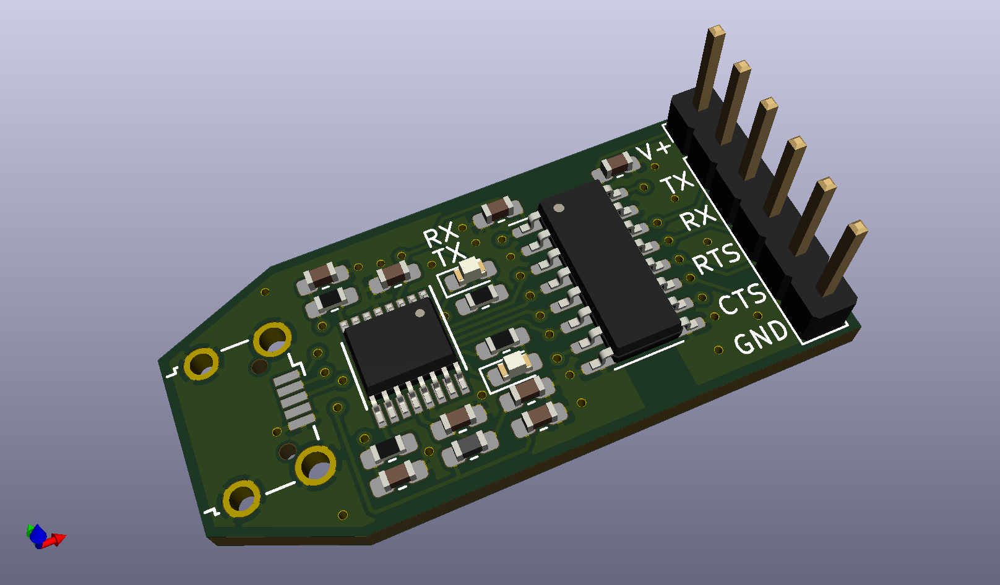

# usbserial

This is a USB to serial (UART) converter employing the FTDI FT230XS chip designed in KiCad. I 
included an optional digital isolator for noisy environments or when galvanic 
isolation is required. 

## BOM

I also included the [interactive html BOM.](usbserial.html)

| References     | Value                     | Footprint | Quantity |
|----------------|---------------------------|-----------|----------|
| C1, C2, C7, C8 | 100n                      | 0603      | 4        |
| C4, C5         | 47p                       | 0603      | 2        |
| C3             | 10n                       | 0603      | 1        |
| C6             | 4.7u                      | 0603      | 1        |
| R1, R2         | 270R                      | 0603      | 2        |
| R3, R4         | 27R                       | 0603      | 2        |
| D1, D2         | green                     | 0603      | 2        |
| U1             | Si8642BB-B-IS1            | SOIC-16   | 1        |
| U2             | FT230XS                   | SSOP-16   | 1        |
| FB1            | MI0603J601R-10            | 0603      | 1        |
| JP1 - JP6      | Jumper (if U1 not placed) | 1206      | 6        |
| J1             | Header 4pin, 2.54mm       | -         | 1        |
| J2             | USB-Micro WE 629105150521 | -         | 1        |

## Datasheets

* [Si8642BB-B-IS1](https://www.silabs.com/documents/public/data-sheets/si864x-datasheet.pdf)
* [FT230XS](https://www.ftdichip.com/Support/Documents/DataSheets/ICs/DS_FT230X.pdf)
* [MI0603J601R-10](https://www.laird.com/sites/default/files/2019-04/MI0603J601R-10_0.pdf)
* [WE 629105150521](https://www.we-online.com/catalog/en/COM_MICRO_SMT_TYPE_B_HORIZONTAL_HIGH_CURRENT/)

## Render

## Prototype

ToDo
